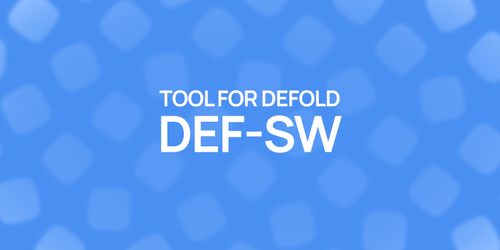

# Defold Service Worker Generator

Generates a service worker for web games exported from [Defold](https://defold.com/).

## Install

1. Install [Nodejs](https://nodejs.org/en) or equivalent

2. Clone this project
   `git clone https://github.com/thinknathan/def-sw`

3. Install dependencies
   `npm i`
   or
   `yarn`

## Usage

1. Build your HTML5 export from Defold
2. Copy your game files into the `copy-game-here` folder (exclude `report.html` and similar)
3. (Optional) Run `yarn minify` or `npm run minify` to reduce the size of vanilla files `index.html` and `dmloader.js`
4. Run `yarn build` or `npm run build` to generate the service worker

- Done! The files will be generated in the `copy-game-here` folder
- Upload all the files inside `copy-game-here` to distribute your game
